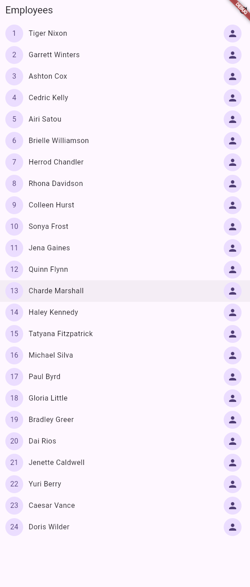
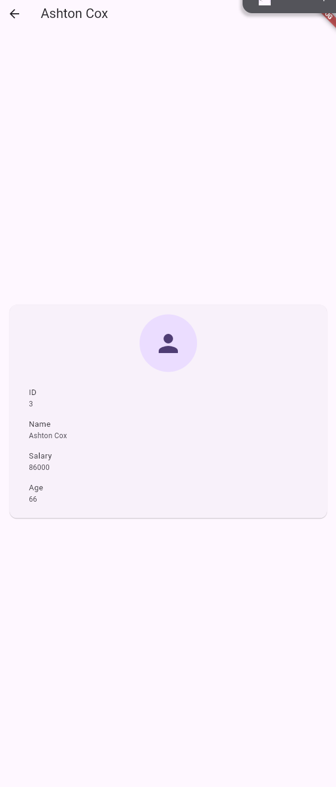
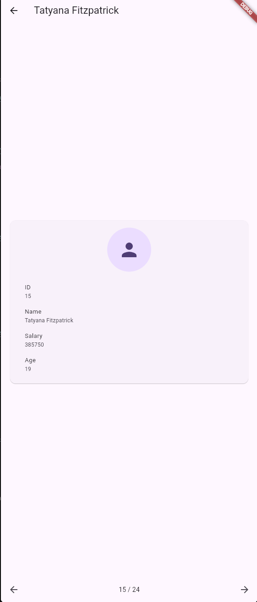
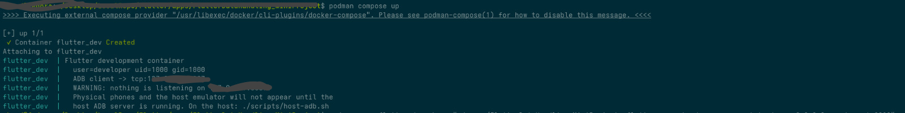
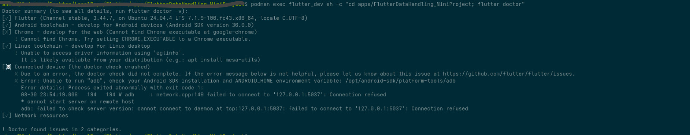
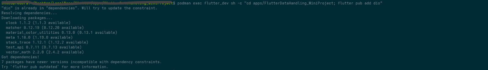
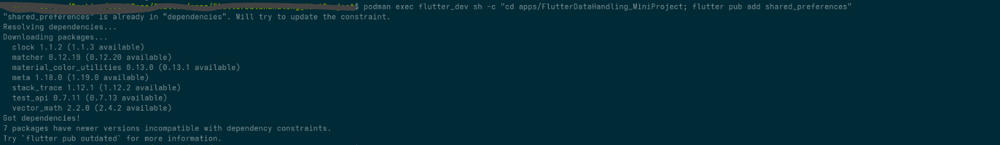
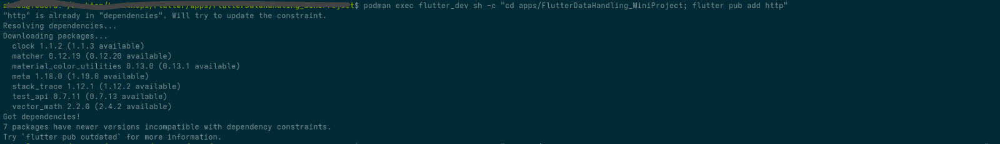
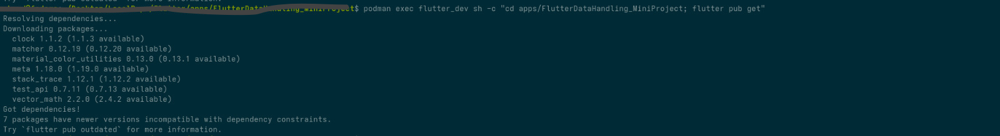
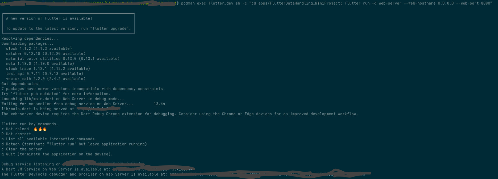

# Flutter Data Handling Mini Project

Flutter app that lists employees from a remote API, caches them locally, and shows employee details with next/previous navigation.

---

## Screenshots

<!-- Replace these files in /.git_images — keep the names or update the paths. -->





---

## Requirements

- [Flutter SDK](https://docs.flutter.dev/get-started/install) (Dart `^3.12.2`)
- Git
- A device, emulator, or Chrome for `flutter run`

Check your setup:

```bash
flutter doctor
```




---

## Clone the project

```bash
git clone <REPO_URL>
cd FlutterDataHandling_MiniProject
```

---

## Install packages

From the project root:

```bash
flutter pub get
```






This installs:

| Package | Role |
|---|---|
| `dio` | Default HTTP client |
| `http` | Optional HTTP client (swap-in) |
| `shared_preferences` | Local cache |
| `cupertino_icons` | Icons |

---

## Run the project

```bash
flutter devices
flutter run
```



Pick a device if more than one is connected:

```bash
flutter run -d chrome
flutter run -d emulator-5554
```

---

## Tech stack

| Layer | Technology |
|---|---|
| UI | Flutter, Material 3 |
| Language | Dart 3.12+ |
| Networking | `HttpClient` contract — `DioHttpClient` (used) or `PackageHttpClient` |
| Cache | `LocalStorage` contract — `SharedPreferencesStorage` |
| Remote API | [Dummy REST API](https://dummy.restapiexample.com) |
| Endpoints | `lib/ExternalResources/APIs.dart` |

---

## Project structure

```
lib/
├── main.dart                          # App entry: wires Dio + SharedPreferences + service
├── ExternalResources/
│   └── APIs.dart                      # Base URL and employee endpoints
├── core/                              # Swappable infrastructure
│   ├── http_client.dart               # HTTP contract + response helpers
│   ├── dio_http_client.dart           # Dio implementation (in use)
│   ├── package_http_client.dart       # package:http implementation
│   ├── local_storage.dart             # Key-value storage contract
│   └── shared_preferences_storage.dart
├── data/
│   ├── models/
│   │   └── employee.dart
│   └── repositories/
│       ├── employee_data.dart         # Employee data contract
│       ├── api/
│       │   └── employee_data_api.dart
│       └── cache/
│           └── employee_data_cache.dart
├── services/
│   └── employee_service.dart          # Cache-first list, get one, refresh, freshList
└── view/
    ├── components/
    │   ├── employee_tile.dart         # List row: id, name, image
    │   └── employee_card.dart         # Full employee card
    └── pages/
        ├── employees_page.dart        # Employee list
        └── employee_details_page.dart # Details + cached next/previous
```

### How the layers fit

- **Core** — hide Dio / `http` / SharedPreferences so they can be replaced later.
- **Data** — `EmployeeData` implemented by API and cache repositories.
- **Service** — reads cache first; if empty, calls the API, stores the result, then returns it. `freshList()` drops cache and fetches again. `cache()` returns the cache repository for pages that need it.
- **View** — list of tiles; details page takes one employee, loads the cached list, updates that item, and shows next/previous only when cache exists.

---

## Useful commands

```bash
flutter pub get          # install dependencies
flutter run              # run on a connected device
flutter test             # run tests
flutter analyze          # static analysis
```

